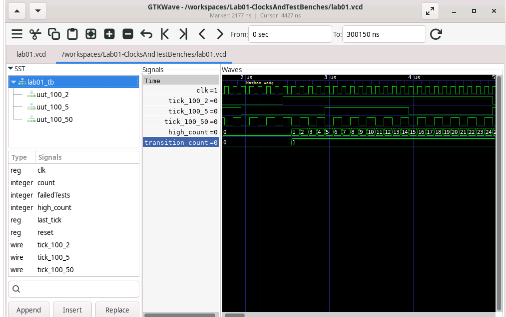

Section 1
The three testbenches that I chose to do were the first given 100hz clock with 2hz tick in which we were given that it should have the count of 500 high count cause it will be high for half the time and that it will transition 20 times.
The second test bench is for a 5 hz tick where it will change to be 50 transitions. The total tick period will be 100/5 = 20 clock cycles. 1000/20 is 50 total transitions.

The third test bench is for a 50 hz tick where it will change to be 50 transitions. The total tick period will be 100/50 = 2 clock cycles. 1000/2 is 500 total transitions.

Section 2

